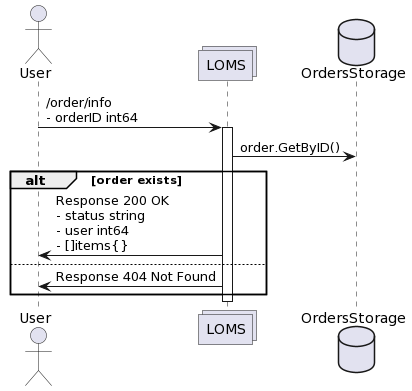
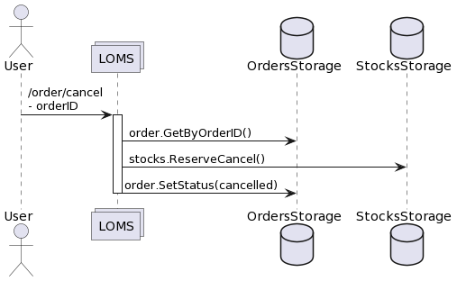

# loms (Logistics and Order Management System) - сервис, отвечающий за учет заказов и стоки по товарам.

## Особенности:
1. Используется grpc-gateway;
2. Валидация proto-структур происходит с помощью protovalidate;
3. Сервис состоит из 2 "подсервисов": Stock и Order - для каждого из которых создается свой контракт .proto.

## Взаимодействия:
## 1. Создание заказа (order)
* Cоздается новый заказ для пользователя из списка переданных товаров с резервированием нужного количества стоков;
* Заказ получает статус "new";
* Резервируется нужное количество единиц товара;
* Если удалось зарезервировать стоки, заказ получает статус "awaiting payment";
* Если не удалось зарезервировать стоки, заказ получает статус "failed".

| Метод | URI           |
|-------|---------------|
| POST  | /order/create |


### Пример входных данных
```
{
    user int64
    items []{
        sku uint32
        count uint16
    }
}
```

### Пример ответа
```
{
    orderID int64
}
```

## 2. Информация по заказу (order)

* Показывается информацию по заказу.

| Метод | URI                    |
|-------|------------------------|
| GET   | /order/info/{order_id} |



### Пример входных данных
```
{
    orderID int64
}
```

### Пример выходных данных
```
{
    status string // (new | awaiting payment | failed | payed | cancelled)
    user int64
    items []{
        sku uint32
        count uint16
    }
}
```

## 3. Оплатить заказ (order)

* Помечается заказ оплаченным;
* Зарезервированные товары переходят в статус купленных (соответствующее количество удаляется из total_count и reserved);
* Заказ получает статус "payed".

| Метод | URI        |
|-------|------------|
| POST  | /order/pay |


### Пример входных данных
```
{
    orderID int64
}
```

### Пример выходных данных
```
{}
```

## 4. Отмена заказа (order)

* Отменяется заказ;
* Cнимается резерв со всех товаров в заказе (соответствующее количество прибавляется к total_count и reserved);
* Заказ получает статус "cancelled".

| Метод | URI           |
|-------|---------------|
| POST  | /order/cancel |



### Пример входных данных
```
{
    orderID int64
}
```

### Пример выходных данных
```
{}
```

## 5. Информация по количеству зарезервированных товаров (stock)

* Возвращается количество товаров, которые можно купить;
* Если товар был зарезерванован у кого-то в заказе и ждет оплаты, его купить нельзя;
* Данные по товарам берутся из stock-data.json (embed)
    - структура stock:
        - sku - товар
        - total_count - всего товаров
        - reserverd - количество зарезервированных

| Метод | URI        |
|-------|------------|
| GET   | /stock/info/{sku} |


### Пример входных данных
```
{
    sku uint32
}
```

### Пример выходных данных
```
{
    count uint64
}
```